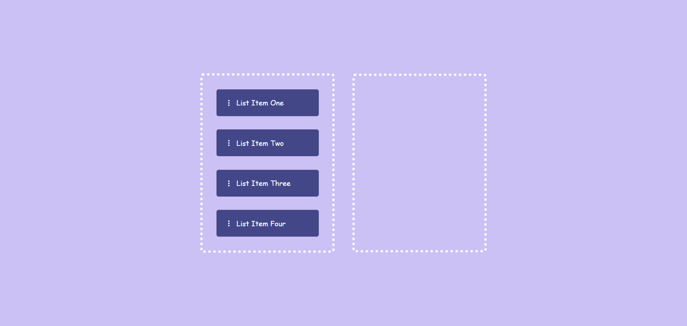

## Effortless Item Organization with Drag & Drop | Drag & Drop Using JavaScript
<a href="https://www.linkedin.com/in/dharmendraverma95/" target="_blank">LinkedIn Profile </a>

<a href="https://www.behance.net/dhirukumar" target="_blank">Behance Profile </a>

## OVERVIEW
DragList is a lightweight, easy-to-use tool that allows users to reorder and organize items within a list using a simple drag-and-drop interface. Perfect for tasks like to-do lists, inventory management, or any other use case that requires flexible list organization. With DragList, you can quickly and intuitively manage your items with no unnecessary complexity.

### DragList
-- A Simple, Intuitive Drag-and-Drop Item List Manager --

## Features 
<ul>
  <li>Drag & Drop Interface: Simply drag and drop to reorder items in your list.</li>
  <li>User-Friendly: No complicated settings or menus—just a clean and intuitive design.</li>
  <li>Lightweight & Fast: Quick to load and seamless interaction, even with large lists.</li>
  <li>Customizable: Easily integrate the list into your own applications or websites.</li>
</ul>

###### Lang
<ul>
  <li>HTML5</li>
  <li>CSS3</li>
  <li>Bootstrap Icon</li>
  <li>ChatGPT [For Content]</li>
  <li>Font Awesome</li>
  <li>Google Font</li>
  <li>ui / ui layout Design</li>
  <li>desgin in Abode XD</li>
</ul>

 
Desktop Desgin 

 
Desktop UI UX Desgin 

 
Desktop Desgin ui-ux Layout 

 
Desktop Desgin 

Cover 
